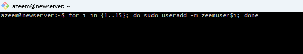
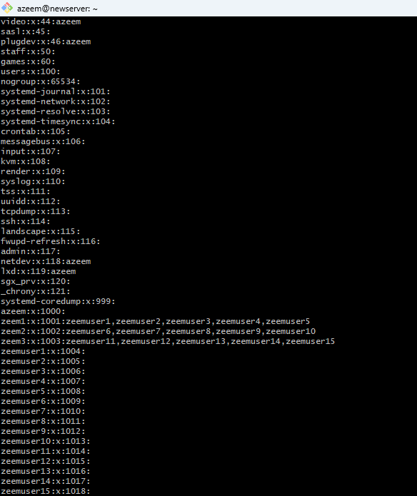
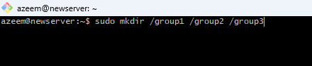
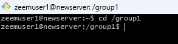
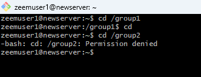

# Linux Assessment
# Users and Group Permissions

This markdown file provides a concise guide on creating groups and users, assigning users to groups, and demonstrating group-based access restrictions with placeholders for images showing each step.

## a. Create 3 Groups and 15 Users

1. **Create Groups**

I created 3 groups by using the "sudo groupadd group1" command

2. **Create Users**

I created 15 users by using the "for i in {1..15}; do sudo useradd user$i; done" command

# List of users and groups

## b. Assign Users across the 15 groups

## c.  Demonstrate Group Access Restrictions

